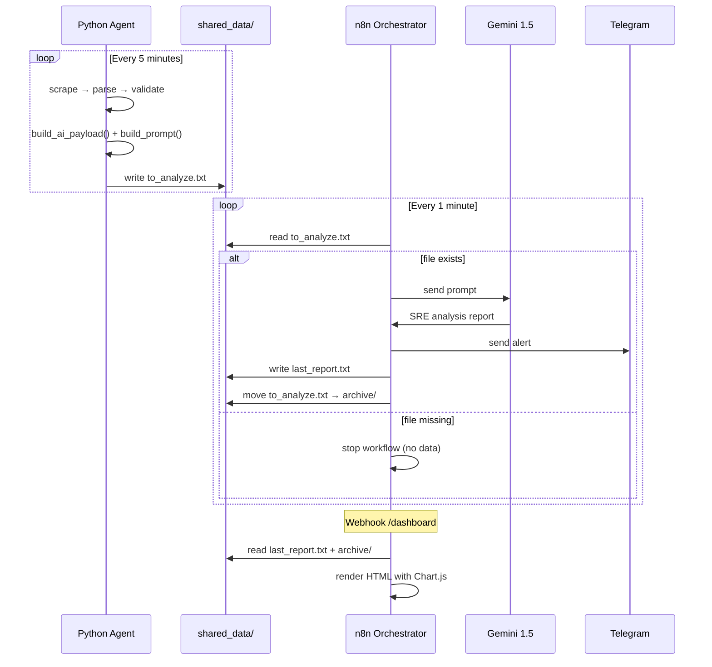

# Projekt4 — Internal Architecture & Developer Notes

> Ten dokument opisuje szczegółową architekturę projektu, przepływ danych oraz uzasadnienie decyzji technicznych i bezpieczeństwa. Przeznaczony dla deweloperów oraz rekruterów chcących zrozumieć _dlaczego_ system działa tak, a nie inaczej.

---

## Table of Contents

1. [Project Structure](#1-project-structure)
2. [Module Reference](#2-module-reference)
3. [Data Flow](#3-data-flow)
4. [Security Architecture](#4-security-architecture)

---

## 1. Project Structure

```
Projekt4/
├── .venv/                  # Virtual environment (not committed)
├── app/                    # Core Python agent
│   ├── __init__.py         # Marks app/ as a Python package
│   ├── ai_adapter.py       # Builds the LLM prompt from analyzer output
│   ├── ai_analyzer.py      # Parses logs, calculates metrics, deduplicates errors
│   ├── ai_client.py        # Gemini API client (mock + real mode)
│   ├── core.py             # Shared business logic utilities
│   ├── logger.py           # Dual-handler logger (internal.log + app.log)
│   ├── parser.py           # Data type validation layer
│   ├── scraper.py          # Demo data generator
│   └── validator.py        # Business rule validation layer
├── scripts/                # Manual debug & inspection tools
│   ├── debug_ai_adapter.py
│   ├── debug_ai_analyzer.py
│   ├── debug_ai_client.py
│   └── debug_ai_payload.py
├── tests/                  # Automated unit tests (pytest)
│   ├── test_ai_adapter.py
│   ├── test_ai_analyzer.py
│   ├── test_ai_client.py
│   ├── test_core.py
│   └── test_logging.py
├── shared_data/            # Inter-container communication layer
│   ├── to_analyze.txt      # Trigger file written by agent, read by n8n
│   ├── last_report.txt     # Gemini analysis result, read by dashboard
│   └── archive/            # Processed reports history
├── logs/
│   ├── app.log             # Clean operational log (filtered)
│   └── internal.log        # Full debug log — source of truth for AI Analyzer
├── n8n/
│   └── monitoring_workflow.json
├── docker-compose.yml
├── Dockerfile
├── main.py
├── requirements.txt
└── .env.example
```

### Key concepts

**`.venv/`** isolates the Python interpreter and all installed packages (e.g. `pytest`). Any terminal showing `(.venv)` is using this isolated environment. Never committed to VCS.

**`app/__init__.py`** marks `app/` as a Python package, enabling `from app.module import ...` imports both locally and inside Docker.

**`shared_data/`** is the message bus between the two containers. It is mounted as a Docker volume into both `projekt4` (writes) and `n8n_orchestrator` (reads). No direct network communication between containers is required.

---

## 2. Module Reference

### `app/scraper.py` — Data Source

Generates between 10–20 synthetic records per cycle with controlled error injection:

- **60%** clean records (valid integer age)
- **20%** Parser errors (age is a random string, e.g. `"OxNJ"`)
- **20%** Validator errors (age is a negative integer, e.g. `-45`)

This distribution ensures the system always has realistic signal to analyze.

---

### `app/parser.py` — Type Validation

Attempts `int(item["age"])` for each record. On failure, logs an `ERROR` with the raw item. No traceback is emitted (`exc_info` omitted) to keep logs clean for the AI Analyzer regex patterns.

---

### `app/validator.py` — Business Rule Validation

Checks `age > 0`. Rejects negative values with an `ERROR` log. Handles missing keys and unexpected exceptions gracefully without crashing the pipeline.

---

### `app/logger.py` — Dual-Handler Logger

Two separate log files serve different purposes:

| File           | Purpose                                   | Filter             |
| -------------- | ----------------------------------------- | ------------------ |
| `internal.log` | Full record — every event, zero filtering | None               |
| `app.log`      | Clean operational view                    | `SmartCleanFilter` |

**`SmartCleanFilter`** suppresses two categories from `app.log`:

1. `INFO` lines containing the word `item` (per-record noise from Scraper/Parser/Validator)
2. `ERROR` lines when `error_cache.json` exists (errors already processed — idempotency)

`internal.log` is the **single source of truth** for `ai_analyzer.py`. It receives everything, unfiltered.

**Timezone:** Both handlers use `WarsawFormatter` which overrides `formatTime()` using `ZoneInfo("Europe/Warsaw")` — timestamps are always in local time regardless of the container's system timezone (UTC).

---

### `app/ai_analyzer.py` — Log Parser & Metric Engine

The core intelligence of the Python agent. Runs in five stages:

**Stage 1 — `read_log_file()`**
Reads `internal.log` in reverse until it hits the `NEW SESSION STARTED` marker. This ensures only the current session's events are analyzed — historical noise is ignored.

**Stage 2 — `extract_log_levels()`**
Uses regex `\|\s(INFO|ERROR|WARNING|DEBUG)\s\|` to count log level frequency. Output example:

```json
{ "INFO": 42, "ERROR": 7 }
```

**Stage 3 — `extract_modules()`**
Detects which module generated each log line by checking for `Scraper:`, `Parser:`, `Validator:` prefixes. Output example:

```json
{ "Scraper": 22, "Parser": 22, "Validator": 20 }
```

**Stage 4 — `extract_errors_with_tracebacks()`**
Identifies `ERROR` entries and collects any following lines that don't match the timestamp pattern as traceback lines. Preserves full context for each error.

**Stage 5 — `group_and_deduplicate_errors()`**
Groups raw errors by message key (stripping the timestamp prefix). Counts occurrences and preserves one sample traceback per unique error type.

**Health Score calculation:**

$$ER = \left(\frac{N_{errors}}{N_{total}}\right) \times 100 \qquad HS = 100\% - ER$$

**Idempotency mechanism:** Error set is fingerprinted with MD5. If the hash matches the previous cycle's hash stored in `error_cache.json`, the pipeline returns an empty payload — no duplicate Gemini calls, no duplicate Telegram alerts.

---

### `app/ai_adapter.py` — Prompt Builder

Transforms the raw payload dict into a structured text prompt. Sections:

```
### SYSTEM CONTEXT
### MODULE ACTIVITY
### UNIQUE ERROR ANALYSIS
### INSTRUCTIONS
```

Returns an empty string `""` if `unique_errors` is empty — signals `main.py` to skip file write and n8n trigger.

---

### `app/ai_client.py` — AI Gateway

Abstraction layer for LLM communication. Supports two modes:

| Mode             | Behaviour                                                                                                                       |
| ---------------- | ------------------------------------------------------------------------------------------------------------------------------- |
| `use_mock=True`  | Generates a dynamic response by parsing error counts from the prompt via regex. Adds `time.sleep(1.5)` to simulate API latency. |
| `use_mock=False` | Placeholder for real Gemini API integration via `GOOGLE_PALM_API_KEY`.                                                          |

In production, this module is bypassed — Gemini is called directly from the n8n workflow node.

---

## 3. Data Flow



### Session isolation

Each Python cycle injects a `NEW SESSION STARTED` marker into `internal.log` before running the pipeline. The AI Analyzer reads the log **backwards** and stops at this marker — only the current session's events are processed.

```
[old session logs]
NEW SESSION STARTED          ← stop reading here (reversed)
Scraper: start scraping      ← these are analyzed
Parser: error parsing item 3
Validator: invalid age...
```

---

## 4. Security Architecture

### Container Security & Privilege Isolation

**Non-root execution:** Both containers run with explicit `PUID`/`PGID` mapping in `docker-compose.yml`. No process runs as `root`. This minimizes risk in the event of a container escape.

**Network segregation:** All services communicate within a dedicated `bridge` network (`backend`). Only n8n exposes a port to the host (`5678`). The Python agent has no external ports — its attack surface is zero.

---

### Filesystem Sandboxing

**`N8N_RESTRICT_FILE_ACCESS_TO`** limits n8n's Read/Write Files node and Code Node (JS `fs` module) to explicit paths only:

```
N8N_RESTRICT_FILE_ACCESS_TO=/home/node/.n8n-files;/home/node/data
```

Separator is `;` not `,` — this is a documented n8n requirement. Using `,` silently fails and grants unrestricted access.

**Volume mount strategy:** `shared_data/` is mounted into both containers at different paths. The Python agent writes to `/app/shared_data/`, n8n reads from `/home/node/data/`. No direct container-to-container network call is needed.

---

### JavaScript & Code Execution Safety

**Module allowlist:** Only `fs` and `path` are permitted in n8n Code Nodes:

```
NODE_FUNCTION_ALLOW_BUILTIN=fs,path
NODE_FUNCTION_ALLOW_EXTERNAL=
```

Leaving `NODE_FUNCTION_ALLOW_EXTERNAL` empty blocks all npm packages — prevents supply chain attacks where a malicious package could be imported in a workflow.

**XSS prevention:** The SRE dashboard escapes all HTML special characters before rendering Gemini's analysis output:

```javascript
const safeAnalysis = analysis
  .replace(/&/g, "&amp;")
  .replace(/</g, "&lt;")
  .replace(/>/g, "&gt;");
```

This prevents XSS injection if a log file ever contains HTML tags or JavaScript snippets.

---

### Credential Management

**Abstraction layer:** The `monitoring_workflow.json` committed to the repository contains only placeholder references (`YOUR_CREDENTIAL_ID`, `YOUR_TELEGRAM_CHAT_ID`). Actual secrets are never stored in the workflow file.

**Secret isolation:** All credentials (Telegram Bot Token, Google Gemini API Key) live exclusively in `.env`, which is excluded from version control via `.gitignore`. The `.env.example` file documents the required variables without values.

**Credential storage:** n8n stores credentials encrypted in its internal SQLite database inside the `n8n_data` Docker volume — never in plain text on the host filesystem.

---

## Running Tests

```bash
# Activate virtual environment
source .venv/bin/activate   # Linux/macOS
.venv\Scripts\activate      # Windows

# Run all tests
pytest tests/ -v

# Run specific test file
pytest tests/test_ai_analyzer.py -v
```

### Manual debug scripts

Run from project root with virtual environment active:

```bash
# Full pipeline: generates fresh logs, builds payload, prints prompt
python scripts/debug_ai_analyzer.py

# Inspect raw payload JSON structure
python scripts/debug_ai_payload.py

# Test prompt builder output only
python scripts/debug_ai_adapter.py

# Test AI client mock response
python scripts/debug_ai_client.py
```

> **Note:** Debug scripts read from `logs/internal.log`. Run at least one full agent cycle first (`python main.py`) or the scripts will report no data.
