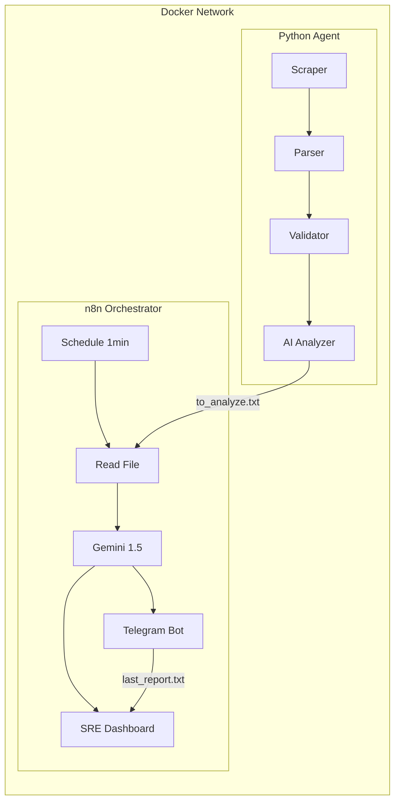

# Projekt4 — AI-Driven SRE Monitoring System

A self-contained monitoring pipeline that combines a **Python observability agent** with **AI-powered orchestration** (n8n + Google Gemini). The system detects anomalies, analyzes root causes via LLM, delivers alerts to Telegram, and serves a live SRE dashboard — all running in Docker.

---

## Architecture



**Observe → Analyze → Act loop:**

1. **Python Agent** runs every 5 minutes — scrapes data, parses it, validates it, and calculates health metrics
2. **Shared Volume** acts as a message bus — `to_analyze.txt` is the trigger file
3. **n8n** polls every 1 minute — picks up the report, sends it to Gemini for root-cause analysis
4. **Gemini** returns a structured SRE report (alert summary, root cause, action plan)
5. **Telegram** delivers the alert instantly
6. **Dashboard** at `/webhook/dashboard` serves a live HTML report with trend history

---

## Tech Stack

| Layer          | Technology                           |
| -------------- | ------------------------------------ |
| Agent          | Python 3.11, custom logging pipeline |
| Orchestration  | n8n 2.9.3 (Docker)                   |
| AI             | Google Gemini 1.5 Flash              |
| Infrastructure | Docker, Docker Compose               |
| Alerting       | Telegram Bot API                     |
| Dashboard      | n8n Webhook + Chart.js               |

---

## Health Score Methodology

The agent calculates two metrics per session before deciding whether to trigger an AI analysis:

$$ER = \left(\frac{N_{errors}}{N_{total}}\right) \times 100 \qquad HS = 100\% - ER$$

- **$N_{total}$** — all log events in the current session (INFO, WARNING, ERROR)
- **$N_{errors}$** — critical failures only (Parser exceptions, Validator breaches)

This means Gemini is only called when the Health Score drops below threshold — avoiding unnecessary API costs and alert fatigue.

---

## Key Design Decisions

**Idempotent alerting** — errors are fingerprinted with MD5. If the same error set repeats across cycles, the pipeline is skipped. No duplicate Telegram messages.

**Archive over delete** — processed reports are moved to `shared_data/archive/` instead of being deleted. The dashboard reads history from this archive to build trend charts.

**Non-root containers** — both containers run with explicit UID/GID mapping (`PUID`/`PGID`). No process runs as root.

**Pinned image versions** — `n8nio/n8n:2.9.3` is pinned to prevent unexpected breaking changes.

**Scoped filesystem access** — n8n's `NODE_FUNCTION_ALLOW_BUILTIN=fs,path` is limited to specific paths via `N8N_RESTRICT_FILE_ACCESS_TO`.

---

## Installation

### Prerequisites

- Docker + Docker Compose
- A Google Gemini API key ([get one here](https://aistudio.google.com/))
- A Telegram bot token ([create one with BotFather](https://t.me/BotFather))

### 1. Clone

```bash
git clone https://github.com/shopatomek/Projekt4.git
cd Projekt4
```

### 2. Configure

```bash
cp .env.example .env
```

Edit `.env` and fill in:

```dotenv
PUID=1000          # run: id -u
PGID=1000          # run: id -g
GOOGLE_PALM_API_KEY=your_gemini_key
TELEGRAM_BOT_TOKEN=your_bot_token
TELEGRAM_CHAT_ID=your_chat_id
```

### 3. Run

```bash
docker-compose up -d --build
```

### 4. Configure n8n (one-time)

1. Open `http://localhost:5678`
2. **Import workflow:** Top-right menu → **Import from File** → select `n8n/monitoring_workflow.json`
3. **Add credentials:** Open the Gemini and Telegram nodes → link your API keys
4. **Activate:** Toggle the **Active** switch (top-right)
5. **Dashboard:** `http://localhost:5678/webhook/dashboard`

---

## Project Structure

```
Projekt4/
├── app/
│   ├── ai_adapter.py      # Builds the prompt sent to Gemini
│   ├── ai_analyzer.py     # Parses logs, calculates health metrics, deduplicates errors
│   ├── ai_client.py       # Gemini API client (mock + real mode)
│   ├── logger.py          # Dual-handler logger (internal.log + app.log)
│   ├── parser.py          # Data type validation
│   ├── scraper.py         # Demo data generator
│   └── validator.py       # Business logic validation
├── n8n/
│   └── monitoring_workflow.json   # Import this into n8n
├── scripts/
│   ├── debug_ai_adapter.py        # Manual test: prompt generation
│   ├── debug_ai_analyzer.py       # Manual test: full pipeline flow
│   ├── debug_ai_client.py         # Manual test: AI client mock
│   └── debug_ai_payload.py        # Manual test: payload inspection
├── tests/
│   ├── test_ai_adapter.py         # Unit tests: prompt builder
│   ├── test_ai_analyzer.py        # Unit tests: log parser + payload contract
│   ├── test_ai_client.py          # Unit tests: AI client
│   ├── test_core.py               # Smoke test
│   └── test_logging.py            # Unit tests: logger + filter behavior
├── shared_data/
│   ├── to_analyze.txt             # Trigger file (created by agent, consumed by n8n)
│   ├── last_report.txt            # Latest Gemini analysis (read by dashboard)
│   └── archive/                   # Processed reports history
├── logs/
│   ├── app.log                    # Clean operational log
│   └── internal.log               # Full debug log (read by AI Analyzer)
├── docker-compose.yml
├── Dockerfile
├── main.py
├── requirements.txt
└── .env.example
```

---

## Running Tests

```bash
# From project root
pytest tests/ -v
```

### Manual debug scripts

```bash
# Test full pipeline (generates fresh logs + prompt)
python scripts/debug_ai_analyzer.py

# Inspect raw payload JSON
python scripts/debug_ai_payload.py

# Test prompt builder output
python scripts/debug_ai_adapter.py

# Test AI client mock
python scripts/debug_ai_client.py
```

---

## Security

- `.env` is excluded from version control via `.gitignore`
- Containers run as non-root (UID/GID mapping)
- n8n filesystem access scoped to `shared_data/` only
- No wildcard module permissions (`NODE_FUNCTION_ALLOW_BUILTIN=fs,path` only)
- Docker image version pinned

---

## Dashboard

Access at `http://localhost:5678/webhook/dashboard` after activating the workflow.

Features:

- Live Health Score gauge
- KPI cards (Error Rate, Events Analyzed, Historical Average)
- Trend chart from archive history
- Full Gemini SRE analysis report
- Auto-refresh every 60 seconds with countdown
- HEALTHY / DEGRADED / CRITICAL status indicator
