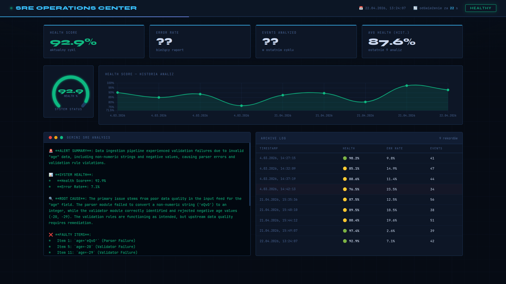
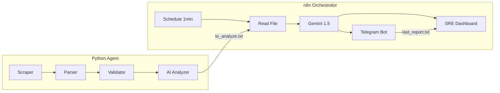

# Projekt4 — AI-Driven SRE Monitoring System

> Autonomous observability pipeline combining a Python monitoring agent with AI-powered root-cause analysis, real-time Telegram alerting, and a live SRE dashboard — all running in Docker.

[](/)
[](LICENSE)
[](/)
[](/)
[](/)



---

## 📊 About the Project

A self-contained SRE monitoring pipeline that scrapes system logs, calculates health metrics using a custom scoring formula, and triggers AI-powered root-cause analysis only when anomalies are detected. The result — a structured incident report with action plan — is delivered to Telegram and rendered on a live dashboard, with zero manual intervention.

### 💡 Design Philosophy

This project targets the core problem of alert fatigue and reactive ops: instead of flooding on-call engineers with raw log noise, it applies a **health score gate** before invoking the LLM. Gemini is only called when the Health Score drops below threshold — reducing API costs and ensuring every alert carries genuine signal.

**What makes this project stand out:**

- 🧮 **Health Score gating** — Gemini is invoked only when `HS = 100% − ER` drops below threshold, eliminating noisy non-actionable alerts
- 🔑 **Idempotent alerting** — errors are fingerprinted with MD5; identical error sets across cycles are suppressed — no duplicate Telegram messages
- 🗂️ **Archive over delete** — processed reports are moved to `shared_data/archive/` instead of being deleted; the dashboard builds trend charts from this history
- 🛡️ **Non-root containers** — both containers run with explicit UID/GID mapping (`PUID`/`PGID`); no process runs as root
- 📌 **Pinned image versions** — `n8nio/n8n:2.9.3` is pinned to prevent unexpected breaking changes
- 🔒 **Scoped filesystem access** — `NODE_FUNCTION_ALLOW_BUILTIN=fs,path` is limited to specific paths via `N8N_RESTRICT_FILE_ACCESS_TO`

---

## 🛠️ Tech Stack

| Layer              | Technology                           |
| ------------------ | ------------------------------------ |
| **AI / LLM**       | Google Gemini 1.5 Flash              |
| **Agent**          | Python 3.11, custom logging pipeline |
| **Orchestration**  | n8n 2.9.3 (Docker)                   |
| **Alerting**       | Telegram Bot API                     |
| **Dashboard**      | n8n Webhook + Chart.js               |
| **Infrastructure** | Docker, Docker Compose               |

---

## 🏗️ Architecture



**Observe → Analyze → Act loop:**

1. **Python Agent** runs every 5 minutes — scrapes data, parses it, validates it, calculates health metrics
2. **Shared Volume** acts as a message bus — `to_analyze.txt` is the trigger file
3. **n8n** polls every 1 minute — picks up the report, sends it to Gemini for root-cause analysis
4. **Gemini** returns a structured SRE report (alert summary, root cause, action plan)
5. **Telegram** delivers the alert instantly
6. **Dashboard** at `/webhook/dashboard` serves a live HTML report with trend history

---

## 🧮 Health Score Methodology

The agent calculates two metrics per session before deciding whether to trigger AI analysis:

$$ER = \left(\frac{N_{errors}}{N_{total}}\right) \times 100 \qquad HS = 100\% - ER$$

- **$N_{total}$** — all log events in the current session (INFO, WARNING, ERROR)
- **$N_{errors}$** — critical failures only (Parser exceptions, Validator breaches)

Gemini is only called when the Health Score drops below threshold — avoiding unnecessary API costs and alert fatigue.

---

## 🚀 Quick Start

### Prerequisites

- Docker + Docker Compose
- A Google Gemini API key → [aistudio.google.com](https://aistudio.google.com/)
- A Telegram bot token → [create with BotFather](https://t.me/BotFather)

### 1. Clone

```bash
git clone https://github.com/shopatomek/Projekt4.git
cd Projekt4
```

### 2. Configure

```bash
cp .env.example .env
```

Edit `.env` and fill in:

```dotenv
PUID=1000                         # run: id -u
PGID=1000                         # run: id -g
GOOGLE_PALM_API_KEY=your_gemini_key
TELEGRAM_BOT_TOKEN=your_bot_token
TELEGRAM_CHAT_ID=your_chat_id
```

### 3. Run

```bash
docker-compose up -d --build
```

### 4. Configure n8n (one-time)

1. Open `http://localhost:5678` and create an account
2. **Import workflow:** Top-right menu → **Import from File** → select `n8n/monitoring_workflow.json`
3. **Add Gemini credentials:** double-click **Message a model** → create new credential with `GOOGLE_PALM_API_KEY`
4. **Add Telegram credentials:** double-click **Send a text message** → paste `TELEGRAM_BOT_TOKEN` + `TELEGRAM_CHAT_ID`
5. **Activate:** toggle the **Active** switch (top-right)
6. **Dashboard:** `http://localhost:5678/webhook/dashboard`

---

## ✅ Verifying the Setup

```bash
# Check agent is producing reports
docker logs projekt4-agent | grep "Health Score"

# Confirm trigger file is being written
docker exec projekt4-agent cat /shared_data/to_analyze.txt

# Check archive is growing
docker exec projekt4-agent ls /shared_data/archive/

# Verify n8n workflow is active
# Open http://localhost:5678 → confirm green "Active" toggle
```

---

## 📁 Project Structure

```
Projekt4/
├── app/
│   ├── ai_adapter.py              # Builds the prompt sent to Gemini
│   ├── ai_analyzer.py             # Parses logs, calculates health metrics, deduplicates
│   ├── ai_client.py               # Gemini API client (mock + real mode)
│   ├── logger.py                  # Dual-handler logger (internal.log + app.log)
│   ├── parser.py                  # Data type validation
│   ├── scraper.py                 # Demo data generator
│   └── validator.py               # Business logic validation
├── n8n/
│   └── monitoring_workflow.json   # Import this into n8n
├── scripts/
│   ├── debug_ai_adapter.py        # Manual test: prompt generation
│   ├── debug_ai_analyzer.py       # Manual test: full pipeline flow
│   ├── debug_ai_client.py         # Manual test: AI client mock
│   └── debug_ai_payload.py        # Manual test: payload inspection
├── tests/
│   ├── test_ai_adapter.py         # Unit tests: prompt builder
│   ├── test_ai_analyzer.py        # Unit tests: log parser + payload contract
│   ├── test_ai_client.py          # Unit tests: AI client
│   ├── test_core.py               # Smoke test
│   └── test_logging.py            # Unit tests: logger + filter behavior
├── shared_data/
│   ├── to_analyze.txt             # Trigger file (created by agent, consumed by n8n)
│   ├── last_report.txt            # Latest Gemini analysis (read by dashboard)
│   └── archive/                   # Processed reports history (used for trend charts)
├── logs/
│   ├── app.log                    # Clean operational log
│   └── internal.log               # Full debug log (read by AI Analyzer)
├── docker-compose.yml
├── Dockerfile
├── main.py
├── requirements.txt
└── .env.example
```

---

## 🧪 Running Tests

```bash
# From project root
pytest tests/ -v
```

### Manual debug scripts

```bash
# Test full pipeline (generates fresh logs + prompt)
python scripts/debug_ai_analyzer.py

# Inspect raw payload JSON
python scripts/debug_ai_payload.py

# Test prompt builder output
python scripts/debug_ai_adapter.py

# Test AI client mock
python scripts/debug_ai_client.py
```

---

## 📊 Service Overview

| Service      | Port | Description                                    |
| ------------ | ---- | ---------------------------------------------- |
| Python Agent | —    | Log scraper + health scorer (runs every 5 min) |
| n8n          | 5678 | Workflow orchestration + Gemini + dashboard    |
| Telegram Bot | —    | Outbound alerting channel                      |

---

## 🔑 API Keys

| Service           | Key Required | Sign Up                                             |
| ----------------- | ------------ | --------------------------------------------------- |
| **Google Gemini** | ✅ YES       | [aistudio.google.com](https://aistudio.google.com/) |
| **Telegram Bot**  | ✅ YES       | [@BotFather](https://t.me/BotFather) on Telegram    |

---

## 🔒 Security

- `.env` excluded from version control via `.gitignore`
- Containers run as non-root (UID/GID mapping via `PUID`/`PGID`)
- n8n filesystem access scoped to `shared_data/` only
- No wildcard module permissions (`NODE_FUNCTION_ALLOW_BUILTIN=fs,path` only)
- Docker image version pinned (`n8nio/n8n:2.9.3`)

---

## 🗺️ Roadmap

- [x] Python observability agent (scrape → parse → validate → score)
- [x] Health Score gating before LLM invocation
- [x] MD5-based idempotent alert deduplication
- [x] n8n orchestration with Gemini 1.5 Flash integration
- [x] Telegram alerting with structured SRE report
- [x] Live SRE dashboard with trend chart (archive history)
- [x] Non-root Docker containers with UID/GID mapping
- [x] Scoped n8n filesystem access
- [ ] Multi-host support (remote scraping targets)
- [ ] Slack alerting channel
- [ ] Prometheus metrics export

---

## 👨‍💻 Author

**Tomasz Szopa** — Data Engineer / AI Engineer

- GitHub: [github.com/shopatomek](https://github.com/shopatomek)

## 📝 License

MIT — see [LICENSE](LICENSE) for details
